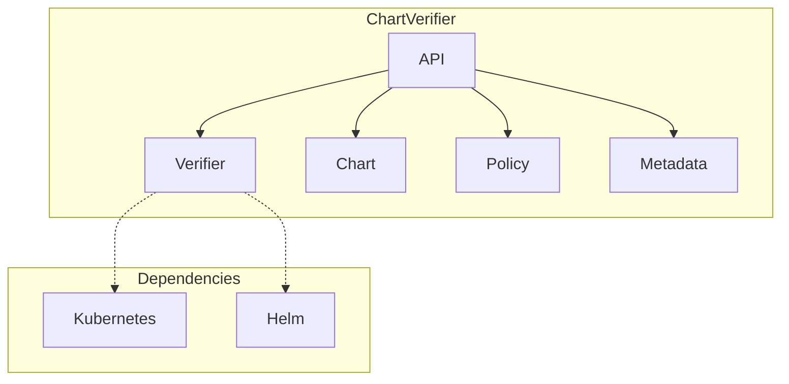
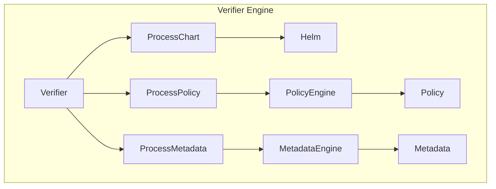
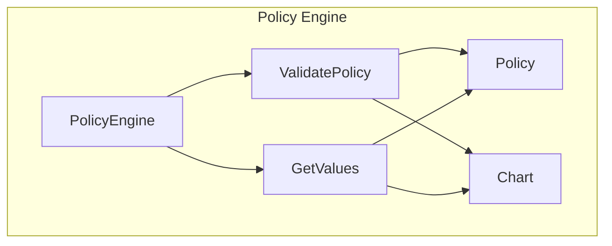
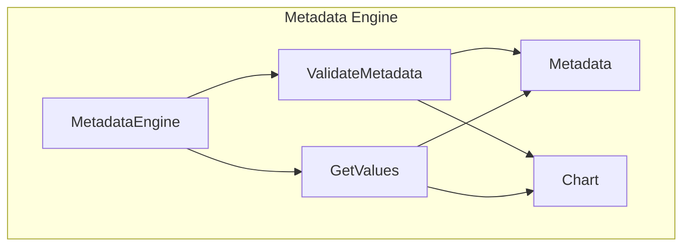

## Understanding Chart Verifier
The chart-verifier code base has an api package that defines the interface for the various components of the chart-verifier tool. Here are a few diagrams that illustrate how the different components in the api package interact with each other:

### ChartVerifier



The ChartVerifier is the top-level interface of the api package, and it exposes methods for verifying charts, policies, and metadata. It depends on the Verifier, Chart, Policy, and Metadata interfaces, which define the methods for interacting with the various components of the chart-verifier tool. The Verifier depends on the Kubernetes and Helm libraries for interacting with the Kubernetes cluster and Helm charts, respectively.

### Verifier Engine



The Verifier interface defines the methods for processing charts, policies, and metadata. It depends on the ProcessChart, ProcessPolicy, and ProcessMetadata interfaces, which define the methods for unpacking charts and evaluating policies and metadata. The ProcessChart interface depends on Helm for unpacking the Helm chart, while the ProcessPolicy and ProcessMetadata interfaces depend on the PolicyEngine and MetadataEngine interfaces, respectively, for evaluating policies and metadata.

### PolicyEngine



The PolicyEngine interface defines the methods for evaluating policies against a chart. It depends on the Policy and Chart interfaces for accessing the policy and chart values, respectively. The ValidatePolicy method performs the evaluation of the policies, while the GetValues method retrieves the values needed for the evaluation.

### MetadataEngine



The MetadataEngine interface defines the methods for evaluating metadata against a chart. It depends on the Metadata and Chart interfaces for accessing the metadata and chart values, respectively. The ValidateMetadata method performs the evaluation of the metadata, while the GetValues method retrieves the values needed for the evaluation.

### Simplified Architecture

```mermaid
graph TD;
  subgraph Chart Verifier;
    CLI-->Verifier;
    Verifier-->Chart;
    Verifier-->Policy;
    Verifier-->Metadata;
  end
  subgraph Validation;
    Validation_Engine-->Chart_Values;
    Chart-->Validation_Engine;
  end
  subgraph Verification;
    Verifier-->Process_Chart;
    Verifier-->Process_Policy;
    Verifier-->Process_Metadata;
    Process_Chart-.->Helm;
    Helm-->Chart_Values;
    Process_Policy-->Policy_Engine;
    Process_Metadata-->Metadata_Engine;
  end
  subgraph Metadata;
    Metadata-->Metadata_Parser;
    Metadata_Parser-->Validation_Engine;
    Validation_Engine-->Metadata_Actions;
  end
  subgraph Policy;
    Policy-->Policy_Parser;
    Policy_Parser-->Validation_Engine;
    Validation_Engine-->Policy_Actions;
  end
  ```